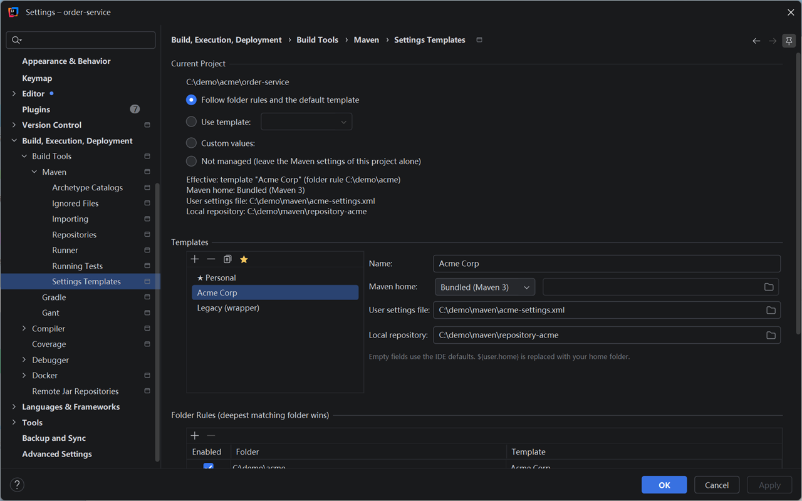
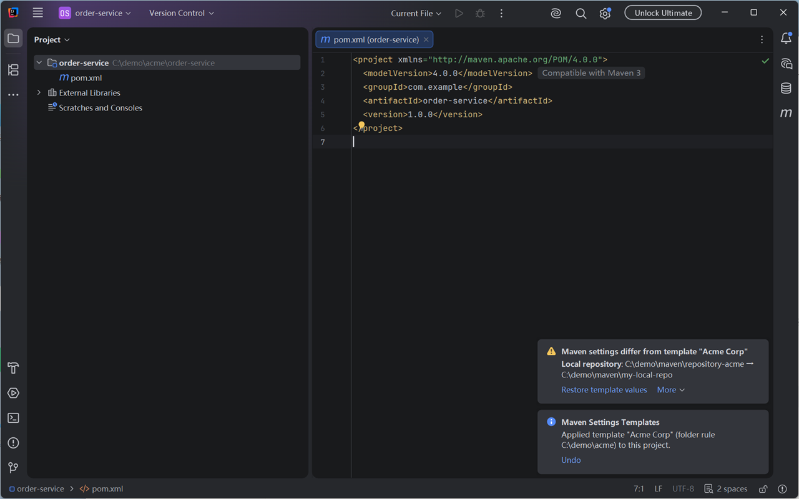

<div align="center">
  
  <h1>Maven Settings Templates</h1>
  <p>Reusable templates for Maven home, <code>settings.xml</code> and local repository,<br>
  applied to each IntelliJ IDEA project automatically.</p>
  <p>
    <a href="https://plugins.jetbrains.com/plugin/34443-maven-settings-templates"></a>
    <a href="https://plugins.jetbrains.com/plugin/34443-maven-settings-templates"></a>
    <a href="https://www.jetbrains.com/idea/"></a>
    <a href="LICENSE"></a>
  </p>
</div>

If you work on projects for different companies or teams, each one usually needs its own
`settings.xml` and local repository. IntelliJ IDEA stores these per project, so every new clone,
every new git worktree and every deleted `.idea` folder starts with the wrong values, and the first
Maven import runs against the wrong repository. This plugin keeps the right values in place for you.

## ✨ Features

- **Templates**: named sets of Maven home (Bundled Maven 3, Maven wrapper or a custom path), user
  settings file and local repository. Paths may contain `${user.home}`.
- **Folder rules**: map a folder to a template, and every project under it uses that template.
  Nested folders work too: the deepest matching folder wins.
- **Default template** for projects that match no rule.
- **Per-project overrides**: use a specific template, custom values, or leave a project alone.
- **Applied when a project opens**, including new clones and new git worktrees. New projects also
  inherit the default template through IntelliJ IDEA's settings for new projects.
- **Drift notifications** when a project's Maven settings no longer match its template, instead of
  silently overwriting your changes.
- Configuration is stored at the application level and keyed by project path, so it survives
  deleting `.idea`.

## 📸 Screenshots

The settings page: the current project follows the folder rule for `C:\demo\acme`, so it gets the
"Acme Corp" template.



A notification appears when a project's Maven settings no longer match its template.



## 📦 Installation

- **From the IDE**: open **Settings | Plugins | Marketplace**, search for
  "Maven Settings Templates" and click **Install**.
- **From JetBrains Marketplace**: open the
  [plugin page](https://plugins.jetbrains.com/plugin/34443-maven-settings-templates) and click
  **Install to IDE** (IntelliJ IDEA must be running).
- **Manually**: download the latest `maven-settings-templates-<version>.zip` from
  [Releases](https://github.com/shizzhang0/maven-settings-templates/releases), then in
  **Settings | Plugins** click the gear icon, choose **Install Plugin from Disk...** and select
  the ZIP file.

## 🚀 Quick start

1. Open **Settings | Build, Execution, Deployment | Build Tools | Maven | Settings Templates**.
2. Add a template for each setup, for example `Personal` and `CompanyA`. Empty fields mean
   "use the IDE default" (Bundled Maven 3, `~/.m2/settings.xml`, `~/.m2/repository`).
   Mark one template as the default with the star button.
3. Under **Folder Rules**, pick a folder such as `D:\work\CompanyA` and choose a template for it.
4. Open a project. The plugin applies the matching template and shows a notification with
   **Undo** the first time it manages that project.

## ⚙️ How a project's settings are chosen

For each project the plugin picks the first match:

1. **Project override**: a template, custom values, or "not managed" chosen for this project
   in the **Current Project** section of the settings page.
2. **Folder rule**: the deepest enabled rule whose folder contains the project.
3. **Default template**.
4. Otherwise the plugin leaves the project alone.

The settings page shows which of these is in effect for the current project.

## 🔔 When settings drift

The plugin remembers what it last wrote to each project:

- If nobody changed those values, template and rule changes are applied **silently**.
- If you changed a project's Maven settings by hand, you get a notification listing the fields
  that differ, with three choices:
  - **Restore template values**
  - **Save as project custom**: keep your values as this project's override
  - **Ignore**: stop asking for this IDE session

## ✅ Compatibility

| | |
|---|---|
| IDE | **IntelliJ IDEA only.** The plugin depends on the Maven plugin bundled with IntelliJ IDEA, so other JetBrains IDEs such as PyCharm or WebStorm cannot install it. |
| Version | **2026.2 or newer** (build 262 and later). Older versions cannot install it. |
| Tested with | IntelliJ IDEA 2026.2.3 (build 262.10968.63) |

There is no upper version limit, so later releases can install the plugin. The Maven plugin API
changes between major releases, though; if something breaks on a newer IDE, please
[open an issue](https://github.com/shizzhang0/maven-settings-templates/issues).

## 🛠 Building from source

```bash
./gradlew buildPlugin
```

The plugin ZIP is written to `build/distributions/`. Other useful tasks:

- `./gradlew runIde` starts a sandbox IDE with the plugin installed.
- `./gradlew verifyPlugin` runs the JetBrains Plugin Verifier.

By default the build downloads IntelliJ IDEA 2026.2.3. To build against an IDE you already have,
set the `intellijPlatformLocalPath` Gradle property, for example in `~/.gradle/gradle.properties`:

```properties
intellijPlatformLocalPath=C:/Users/you/AppData/Local/Programs/IntelliJ IDEA
```

Building requires Java 25. The JetBrains Runtime bundled with IntelliJ IDEA 2026.2 works; point
Gradle at it with `org.gradle.java.installations.paths` if no JDK 25 is installed.

## 📄 License

[Apache License 2.0](LICENSE)
